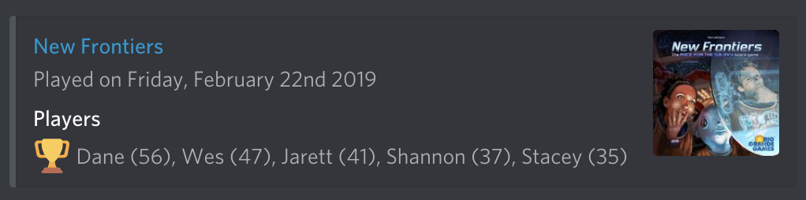

# Nemecord

A simple way to send [Nemestats][nemestats] plays to Discord:

## Installation

At the moment you'll need your own instance for your Discord. I run mine on Zeit's Now (for free) and it works really well.

1. Create [a new Discord Webhook](https://support.discordapp.com/hc/en-us/articles/228383668-Intro-to-Webhooks)
2. Clone this repository
3. Copy/rename `now.json.example` to `now.json`
4. Change the `GAMING_GROUP_ID` in `now.json` to match your [Nemestats][nemstats] group ID (e.g. with a url of `https://nemestats.com/GamingGroup/Details/13468` your ID is `13468`)
5. Add the following secrets to your now project:
    - `now secret add sentry_dsn <your sentry.io DSN>`
    - `now secret add discord_webhook_url <your discord webhook url>`
6. Deploy to [Now](https://zeit.co/docs/v2/deployments/basics/)
7. Create an alias for your Now deployment (e.g. `now alias https://project-234asf3.now.sh/ project.now.sh`)
8. Use something like [cron-job.org](https://cron-job.org/) to schedule a recurring job, daily is usually enough.

[nemestats]: https://nemestats.com
